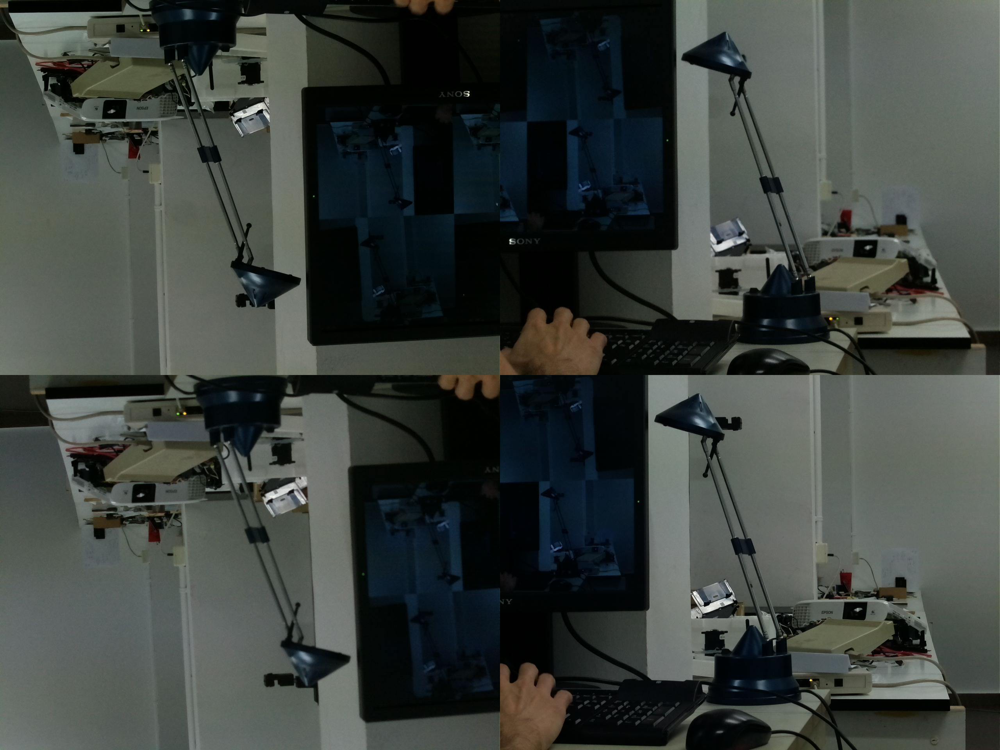

# Netcam
Application to visualize Raspberry pi cameras over a local network.



## Usage
Firstly, the file `pi_server.py` must be run in all Rasperries having a camera
module in the network. Right now, it only works with the legacy driver. Support
for libcamera will be considered once its Python API becomes stable.

Secondly, the `test_visualization.py` can be run to visualize the streams from the
Raspberry pi cameras. Running with no arguments, prompts us to introduce a list
of IP directions corresponding to the ones of the cameras, as well as the
geometry in which we wish to visualize them. If invoked with an argument,
it will be taken as the name of the JSON configuration file, containing
the following two fields
```json
{
    "geometry": ["n", "m"]
    "dirs"    : ["ip_0", "ip_1", "...", "ip_n*m"]
}
```
which are just the geometry and IP directions of our cameras.

